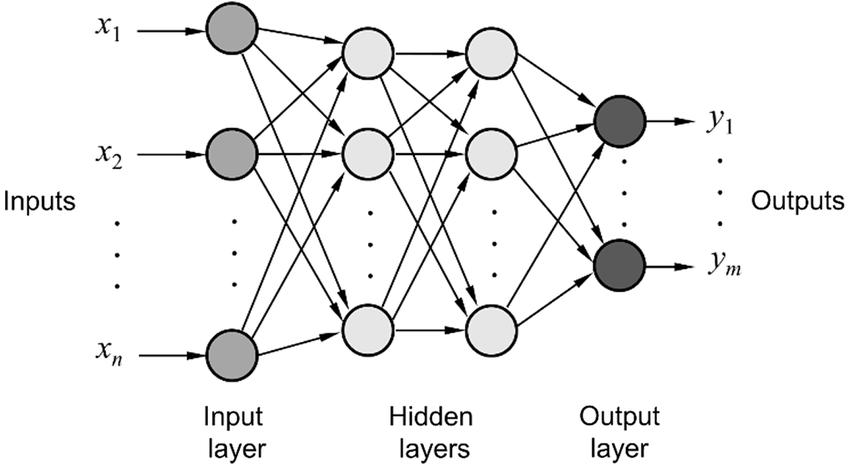

# Multi_Layer_Neural_Network
A multi-layer neural network contains more than one layer of artificial neurons or nodes ( Besides the input and output layers, they contain one or more layers in between which is called hidden layer(s) ). Multi-layer neural networks can be set up in numerous ways. Typically, they have at least one input layer, which sends weighted inputs to a series of hidden layers, and an output layer at the end. These more sophisticated setups are also associated with nonlinear builds using sigmoids and other functions to direct the firing or activation of artificial neurons. 

Having multiple layers provides NN a robust nature, provides more generalization to the structure. Having multiple layers provides network the flexibility to generalize the complex function.<b> So we can say, Neural networks (kind of) need multiple layers in order to learn more detailed and more abstractions relationships within the data and how the features interact with each other on a non-linear level.</b>

 
---

I used two different methods while training network : <b>Stochastic Gradient Descent (SGD) </b> and <b>Stochastic Gradient Descent with momentum</b>.

Extreme version of mini-batch gradient descent with batch size equals to 1 is called Stochastic Gradient Descent. Stochastic Gradient Descent with momentum almost always works better and faster than Stochastic Gradient Descent.  Stochastic Gradient Descent with momentum is method which helps accelerate gradients vectors in the right directions, thus leading to faster converging. It is one of the most popular optimization algorithms and many state-of-the-art models are trained using it. 

---

#  How To Use Program?
As I said before, I used C++ forms to make an easy GUI (Graphic User Interface) for both parts of the project, this way users can easily see the output and result of network. 

<b>After cloning the repository, for multi-layer network all you need is to open the path : 
"Multi_Layer_Neuron_Network\Debug\" 
	
And then run the executable file :
"Multi_Layer_Neuron_Network.exe" </b>

Our Application form is as in the image above . In Settings Group box (Top Right), users must select the number of classes they want to use (the number of neurons in output layer), and then specify the number of hidden layers they want to reveal between input and output layer. Users also need to specify the method of training they want the network to use ( two training type is available: Stochastic Gradient Descent[SGD] and Stochastic Gradient Descent with Momentum[SGD_M]).

After these settings users should click on set button to set the settings. And now they are able to add samples in coordinate plane. And now they are able to add samples in coordinate plane. The samples in coordinate plane that are selected by the users will be the input of the network, since every sample have two coordinates (x and y coordinates) our network is going have two inputs (so our feature space is going to be in 2 dimension). I should also mention that our training type will be supervised therefore we need users to determine which class each sample belongs to (they need to label each sample). They can label the samples by choosing the label(class-id) from class id combo box that is right below set button. After adding samples they can start training process by clicking the ‘Train’ button. **The Output of the network will be shown as lines separating the samples from different classes. This means that network use the given samples to train itself and then draws the line(s) showing that it can distinguish between the given samples. The number of lines depends on the number of neurons in the first hidden layer.**

In the lower right part, in "Information" group box, users can see some information about the network such as : total number of samples they selected, the x and y coordinates for each new sample selected, the calculated error in each cycle of training, the number of cycles it takes the network to train itself and the architecture of network .

note : number of hidden layers can be between 1 and 9 and the neurons in each hidden layer can also be between 1 and 9, output layer can be between 2 and 9.

| Some Examples |
| --- |
| Stochastic Gradient Descent Example |
| |
| --- |
| Stochastic Gradient Descent With Momentum Example |
|  |

NOTE :
<b>More complex examples will take much more time to train and produce the result. Also, for more complex examples, straight lines will not be enough to distinguish between classes, because we only see that in 2 dimension space. Coloring the background would be a good way to separate the boundary between classes, but I haven't found a way to do that yet. </b>

<b>The network would continue to train itself and calculate error until the calculated error is less than the threshold ( which I set to 0.001 ). In some cases, you may find that the error no longer decreases, that is because the number of the neurons in layers, or number of hidden layers themselves are not enough. So users need change their given parameters and settings.</B>
