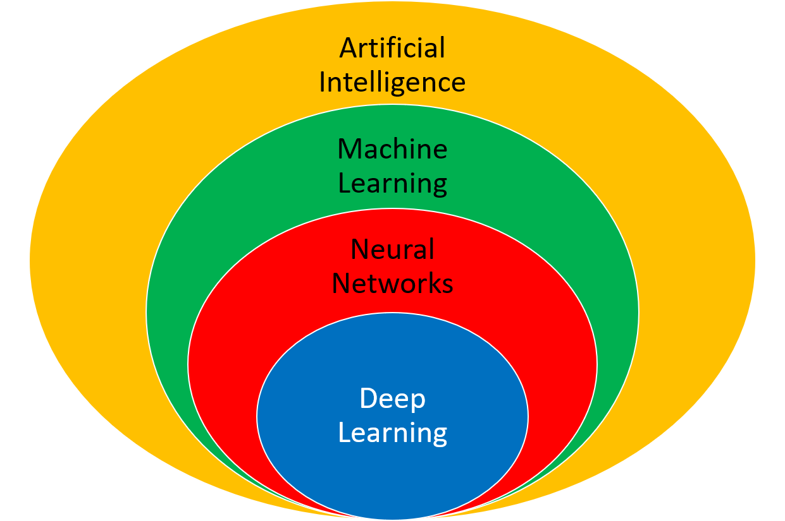
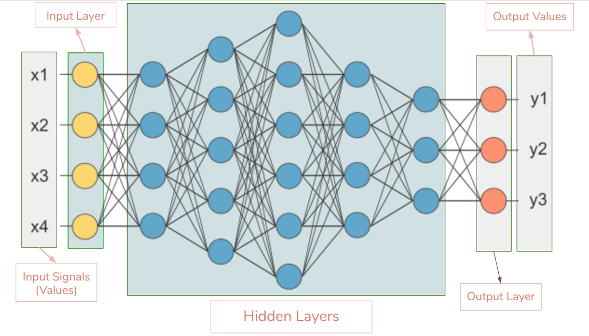
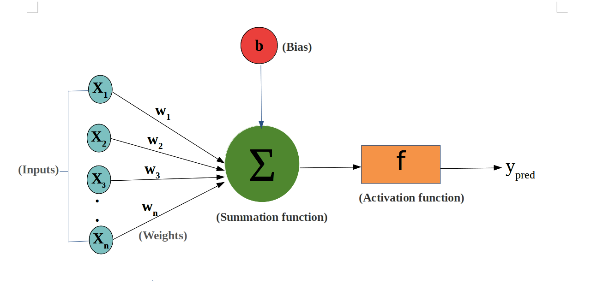
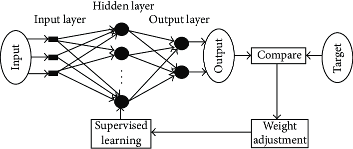

# What is it about ?
This is a project that I have been coding to learn more about Artificial Neural Network (ANN). It consists of two main parts; first part, I just coded a simple Single Layer network (a neural network with only one input and one output layer) and the second part is multi-layer network (a network with hidden layers between input and output layers).
<b>The details about each part is added to its own folder. So you can find inforamtion about single layer network at 'Single_Layer_Neruron_network' directory and multilayer network at 'Multi_Layer_Neuron_Network' directory</b>.

- > [Single_Layer_Neural_Network](https://github.com/ramixix/Neural_Network/tree/main/Single_Layer_Neruron_Network)
- > [Multi_Layer_Neural_Network](https://github.com/ramixix/Neural_Network/tree/main/Multi_Layer_Neuron_Network)

In this Readme file I'm going to explain the general operation and ideas in Neural Network.

## Neural_Network
Nerual networks form the base of deep learning, that itself is subset of machine learning, where the algorithms are inspired by the structure of human brain.

Neural networks take in data and train themselves to recognize the patterns in the given data and predict the output for a new set of similar data.

## How neural networks work?
a standart neural network is made up of layers of neurons (input-layer, output-layer, hidden-layer), these neurons are core processing units of the network.

- The first layer is called <b>Input Layer</b>, which receives the input.
- The last layers is called <b>Output Layer</b>, which is the final output of network.
- In between existe the <b>Hidden layers</b> which perform the most of the computations requried by our network.

Neurons of one layer are connected to neruons of the next layer through channels. Each of these channels are assigned a numerical value known as weight.
The inputs are multiplied to the corresponding weights and their sum is send as input ot the nerons in the hidden layer.

Each of Neurons in network is associated with a numerical value called the <b>bias</b>, which is added to the input sum. After calculation, the whole value then passed through a threshold function called the <b>Activation Fuction</b>. the result of the activation function determines if the particular neuron will get activated or not. An activated neuron transmits data to the neurons of the next layer over the channels. In this manner the data is propagated through the netwrok, this is called <b>Forward Propagation</b>.

The neurons with the highest value in the output layer fire and determine the output. Value is basically a probability. The neural network often makes incorrect prediction at the **training level**. The question is how the network detects that the prediction is wrong and trains itself to produce the correct output ???

This can be done in two ways : **Supervised or Unsupervised**

## Supervised Learning
As the name suggests, <b>supervised learning</b> takes place under the supervision of a teacher. During the training of ANN under supervised learning, along with each input, we (as teacher) also determine an expected output that we expect the network to produce. Then we take the output that network produce and compared it against the actuall or the expected output that we (as teacher) give, and calculate the error
Then we take the output produced by the network and compare it with the actual or expected output. An error signal is generated if there is a difference between the network output and the expected/desired output. On the basis of this error signal, the weights would be adjusted until the network output is matched with the desired output. Adjuting weight and bias values based on the generated error is called <b>Back Propagation</b>.

<b>This cycle of forward propagation and backward propagation is iteratively perfomred with multiple inputs .  This processes continues until our weights are assigned such that the network can predict the correct output in most of the cases.  This whole process of adjusting the values to get the correct output is called the Training Phase. </b>

<b>Note: Both parts of my project (single and multi-layer) are written with supervision (in supervised manner</b>.
