# Single_Layer_Neural_Network

A single-layer neural network represents <b>the most simple form of neural network</b>, where there is only one input and one output layer. This single-layer design was part of the foundation for systems which have now become much more complex.

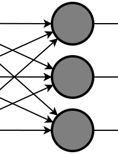

---

I used two different learning rules in my network : <b>Perceptron Learning Rule</b> and <b>Delta Learning Rule</b>. The difference between these two rules, is simply in the activation functions  in both of them. (also known as Threshold Logic Unit[TLU]).  (Learning rule is **a method or a mathematical logic**. It helps a Neural Network to learn from the existing conditions and improve its performance. In other way, it is our training phase rules.) 

-  The perceptron, has a step function in its output neuron that outputs only 2 values <b> 1 and -1 </b>. It takes an input, aggregates it (weighted sum) and returns 1 only if the aggregated sum is more than some threshold else returns -1. A single perceptron can only be used to implement **linearly separable** functions.

	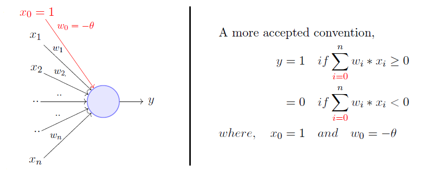
	
	---
	
- the **delta rule** is a [gradient descent](https://en.wikipedia.org/wiki/Gradient_descent "Gradient descent") learning rule for updating the weights of the inputs. The Delta Rule tries different values for the weights in a neural network, and depending on how accurate the output of the network is, it will make certain adjustments to certain weights (i.e., increase some and decrease the other). It will try to increase and decrease the weights in a way that the error of the output would go down, during training. The error function measures the difference between the generated output and the expected/desired output for every example. Note that the error is a function of our weight vector. The Delta rule searches for these weight vectors and uses them to generate the output for a given training example. Then by measuring the error, it would update the previously chosen weights to new values in a way that the output for the subsequent training examples would get closer to the expected output. So, the more the training goes on the better weights would the Delta rule find, and the error for those weights would become less and less. Until eventually, the network has converged and we say that the model has been trained.
	
	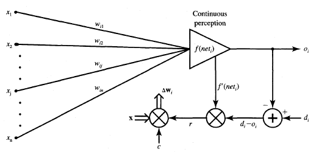
	
---

#  How To Use Program?
I used C++ forms to make an easy GUI (Graphic User Interface) for my project, this way users can easily see the output and result of network. 

<b>After cloning the repository, for single-layer network all you need is to open the path : 
"Single_Layer_Neruron_Network\Debug\" 
	
And then run the executable file :
"Single_Layer_Neruron_Network.exe" </b>

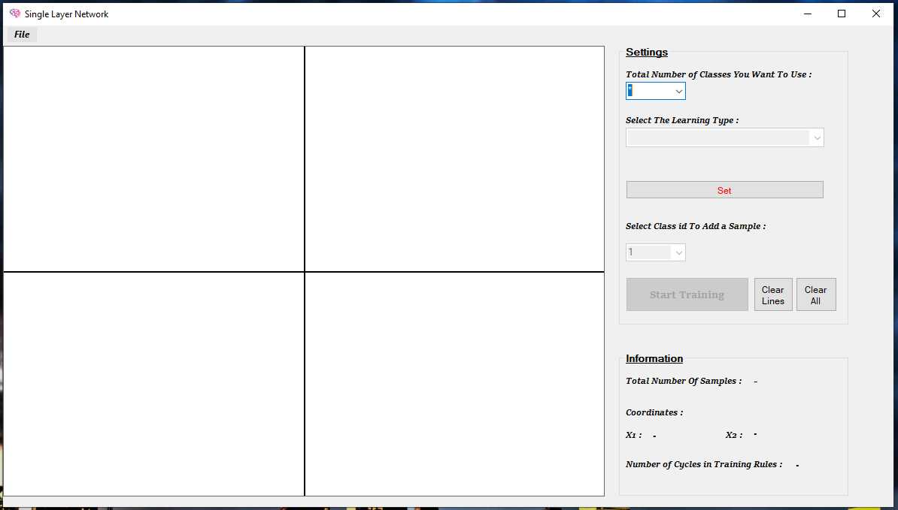

Application form looks like the picture above. In Settings Group box (Top Right), user must select the number of classes they want to use (the number of neurons in output layer in other words), and then specify the learning type they want network to use and train (Percetron and Delta Rules are available ). After these two settings users should click on set button to set the settings they have chosen. And now they are able to add samples in coordinate plane. **The sample coordinates selected by the users will be the input of the network**, since every sample have two coordinates (x and y coordinates) our network is going have two inputs (so our feature space is going to be in 2 dimension). As I mentioned before our training type will be supervised therefore we need users to determine which class each sample belongs to (label the samples). They can label the samples by choosing the label from class id combo box that is right below set button. After adding samples they can start training process by clicking the ‘Start Training’ button. **The Output of the network will be shown as a line separating the samples from different classes. This means that network use the given samples to train itself and then draws a line showing that it can distinguish between the given samples.**

At right of the ‘Start Training’ button we have to more buttons that give users the option to remove drawn lines or clear the entire coordinate plane. "Information" group box gives users some information about the total number of samples they selected, the x and y coordinates for each new sample selected and the number of cycles it did take for network to train itself.

| Some Perceptron Learning Examples |
| --- |
| 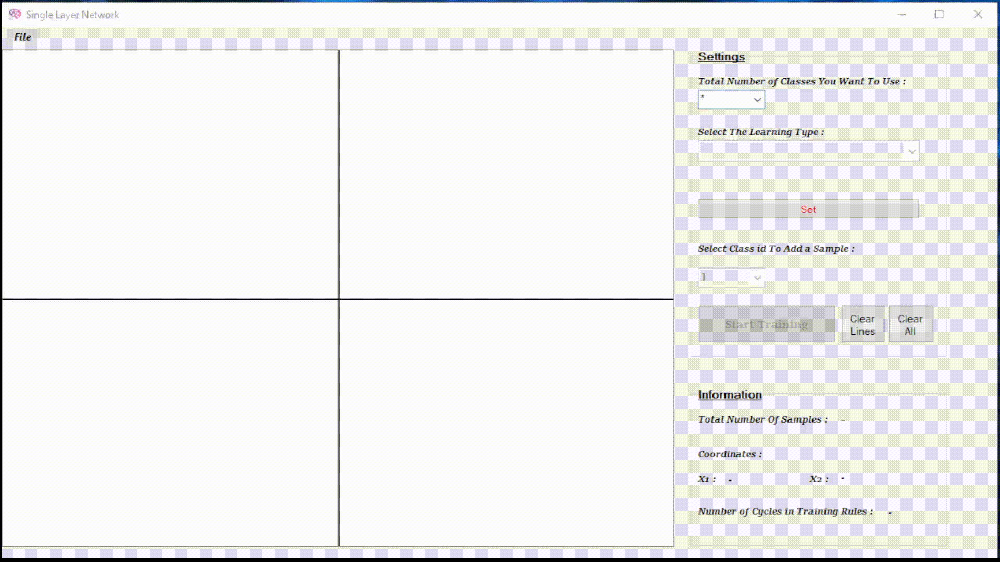  |
|  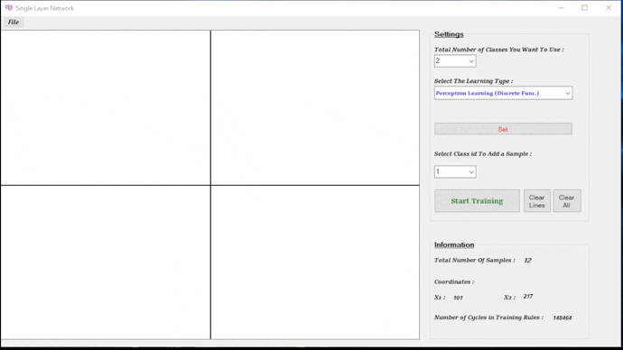 |
|  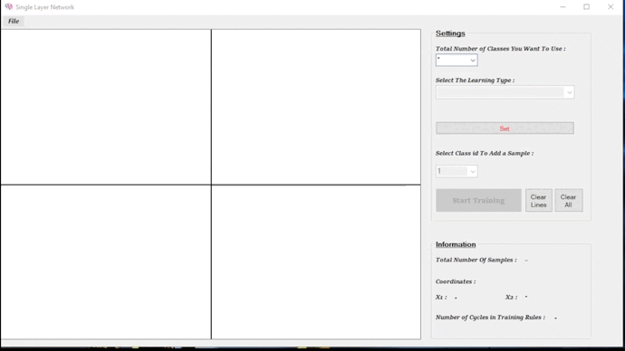 |
|  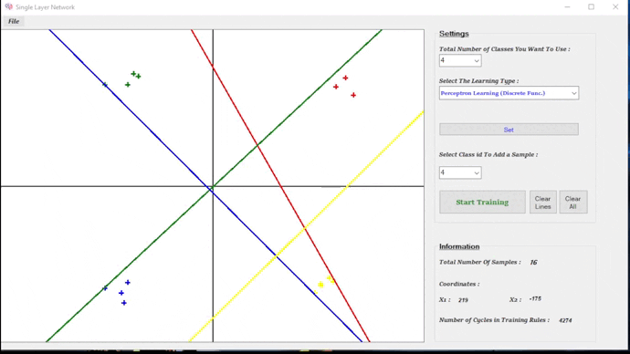 |

Perceptron Learning is going to run faster than the Delta Learning, because it simply identifies whether a point belongs to a set(class) and draws the line(s) separating the sets. But Delta Learning is going to find the best line that can separate the sets(classes). 
I used z-scored normalization to normalized the points (inputs) given to network before any operation. This way the location of points might change on coordinate plane but their position relative to each other does not.

| Some Delta Learning Examples |
| --- |
| 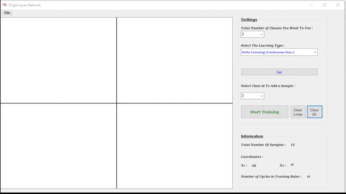  |
|  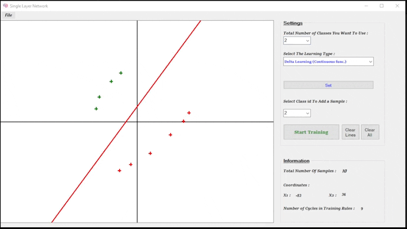 |
|  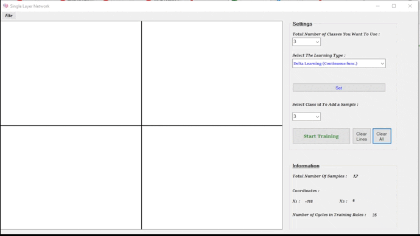 |
|  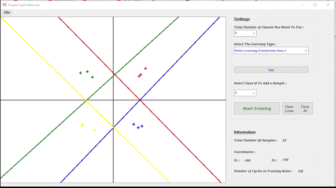 |

You are also free to look at all the source code and modify it as you wish. You can also ask your questions by connecting to me via the e-mail I shared on my main github page.
